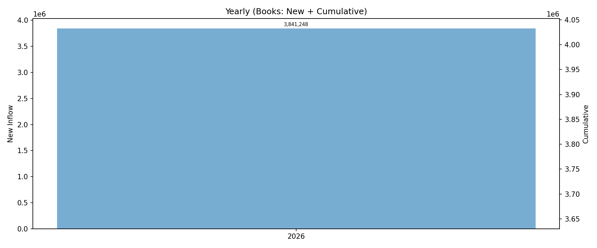
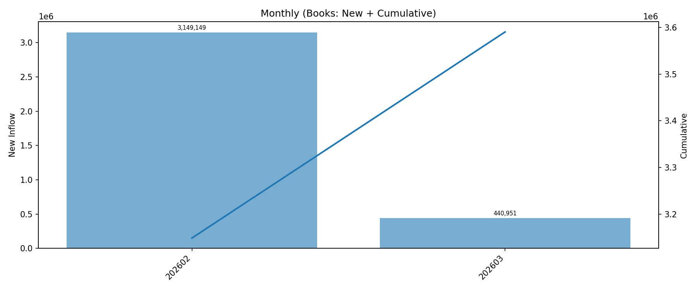
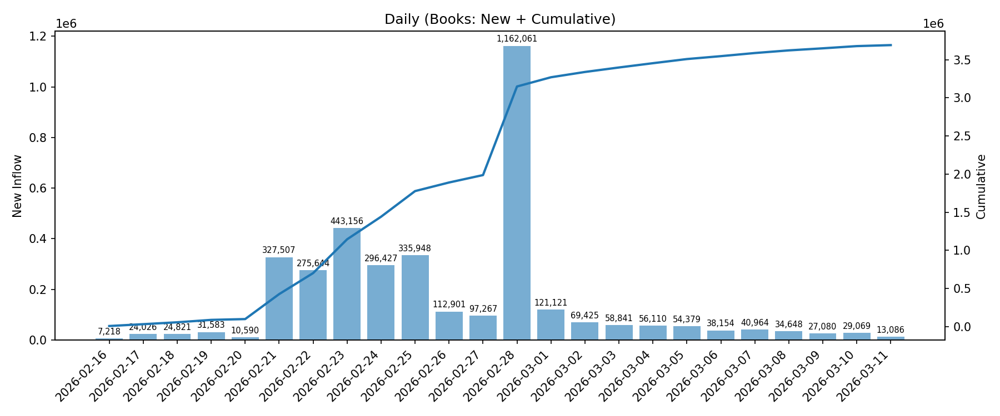
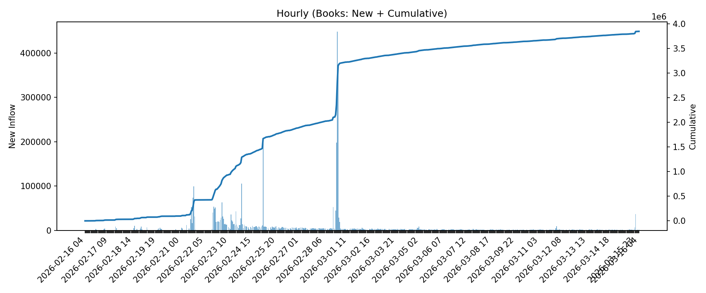

# 수집 데이터 집계

- 업데이트 시각(KST): 2026-02-23 01:57:33

## 핵심 지표
- 총 고유 ISBN 수: **1,594,074**
- 저자 수: **368,455**
- 출판사 수: **89,456**

## 차트

> Year/Month/Day/Hour는 각 항목(ISBN/저자/출판사)의 '최초 등장 시각' 기준 신규 유입을 집계합니다.
