# 수집 데이터 집계

- 업데이트 시각(KST): 2026-03-06 16:59:39

## 전체

- 총 고유 ISBN 수: **3,534,048**
- 저자 수: **622,384**
- 출판사 수: **151,348**

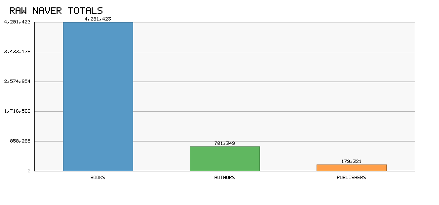

## 출간일(pubdate) 기준 통계

- 출간연도(YYYY 이상) 파싱 가능 ISBN: **3,523,637**
  - 연도만(YYYY): **0**
  - 연/월(YYYYMM): **0**
  - 연/월/일(YYYYMMDD+): **3,523,637**
- 출간일 파싱 불가/없음 ISBN: **10,447**

### Books (Published Date)
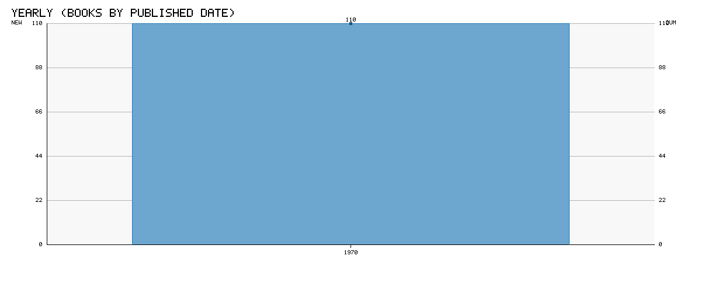

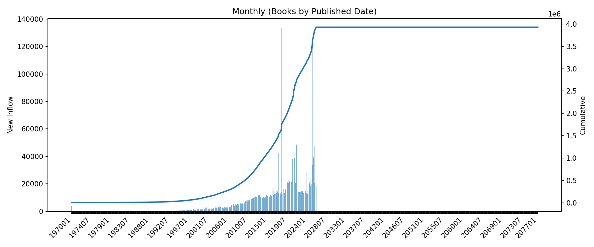

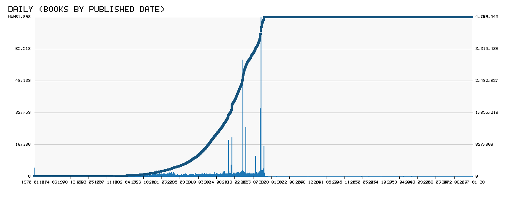

📚 Published Date Details (Authors/Publishers)

### Authors

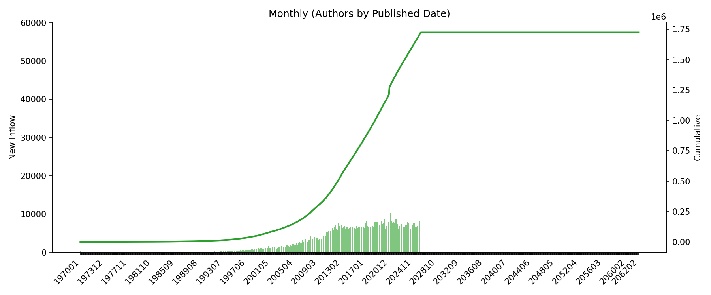

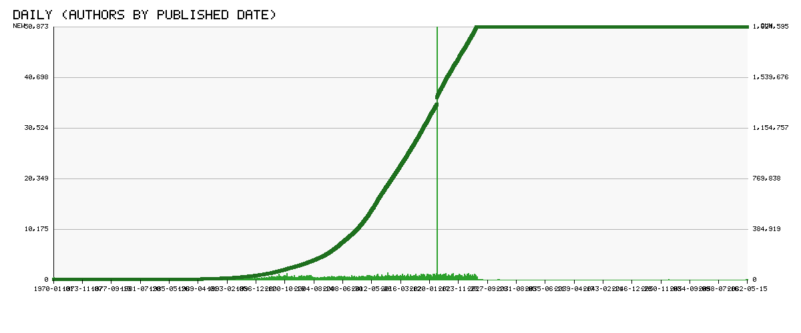

### Publishers
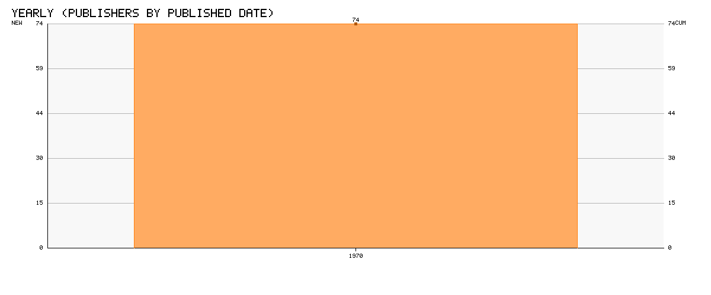

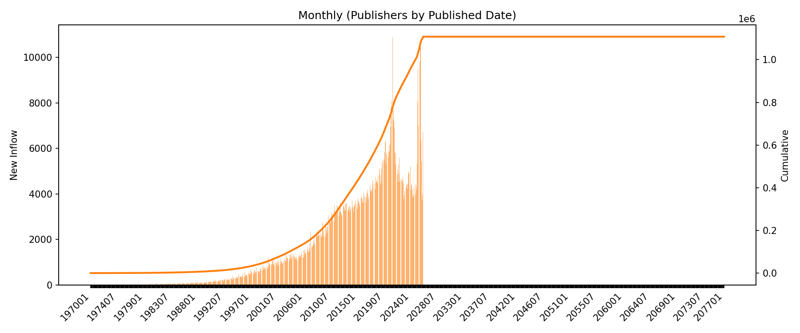

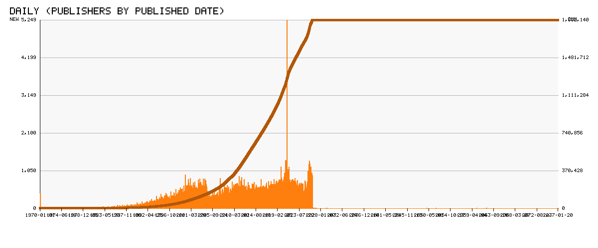

## 📊 Monthly Overview (New + Cumulative)

### Books
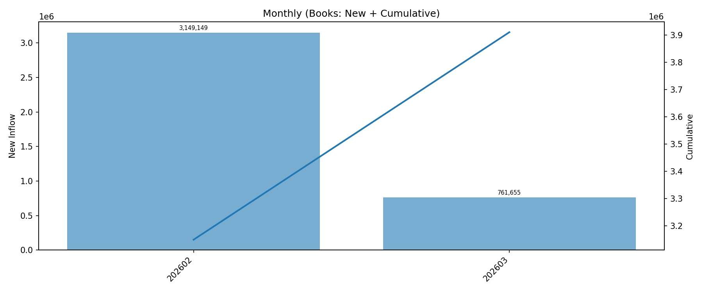

### Authors
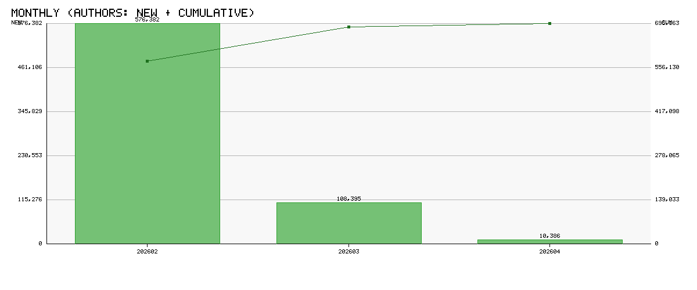

### Publishers
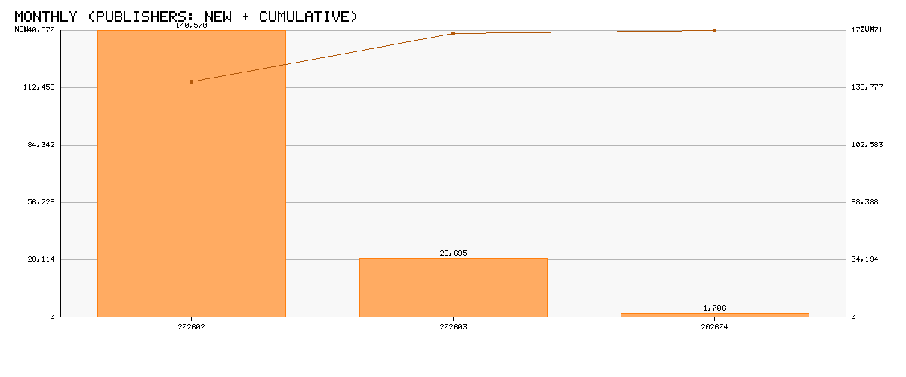

📅 Yearly Details

### Books

### Authors
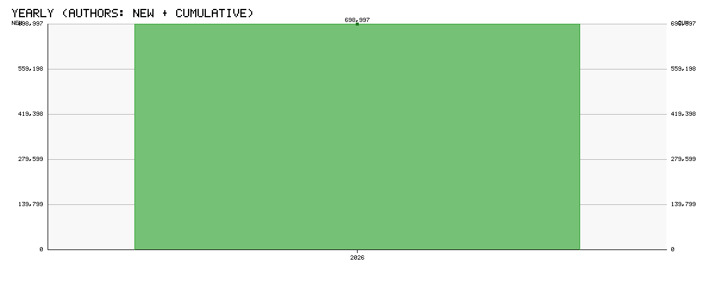

### Publishers
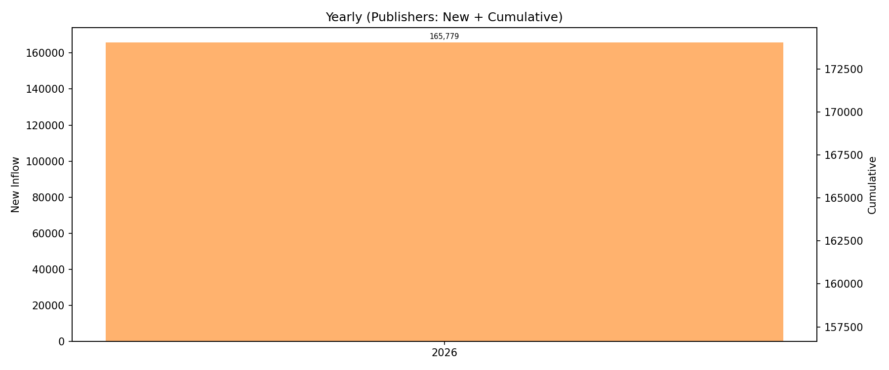

📆 Daily Details

### Books
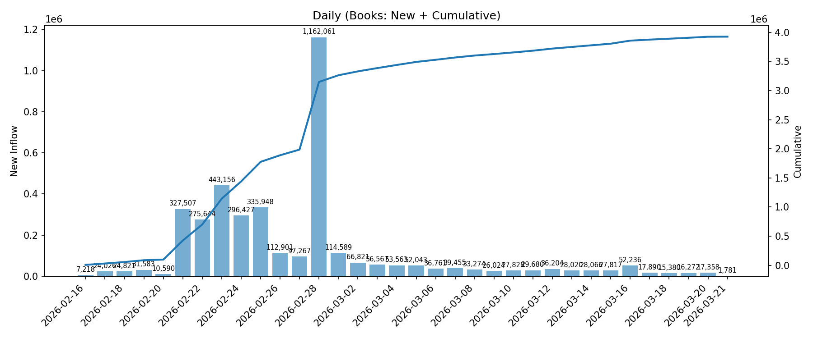

### Authors
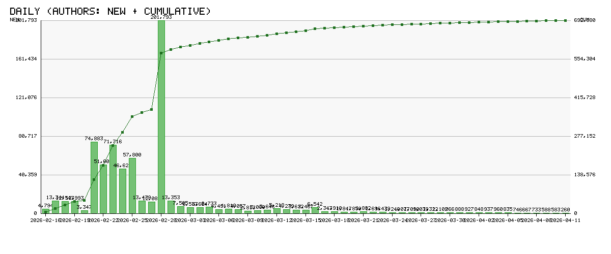

### Publishers
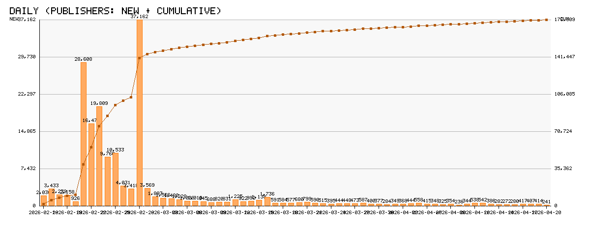

⏱ Hourly Details

### Books
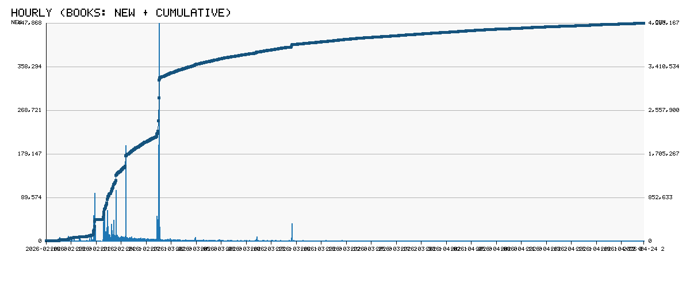

### Authors
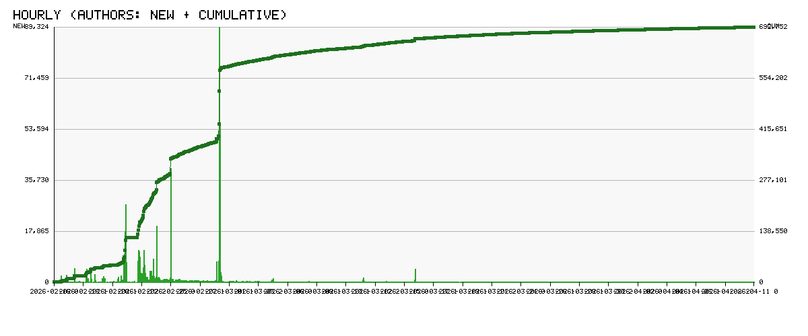

### Publishers
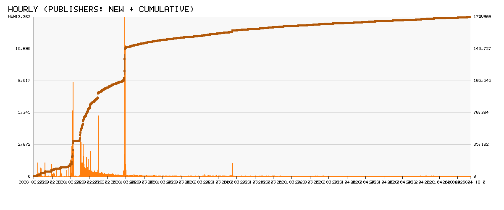

> 시계열은 각 항목(ISBN/저자/출판사)의 '최초 등장 시각' 기준 신규 유입을 집계합니다. (빈 구간은 0으로 채움)
> 모든 시계열 차트는 **신규 유입(막대) + 누적(선)** 을 함께 표시합니다.
